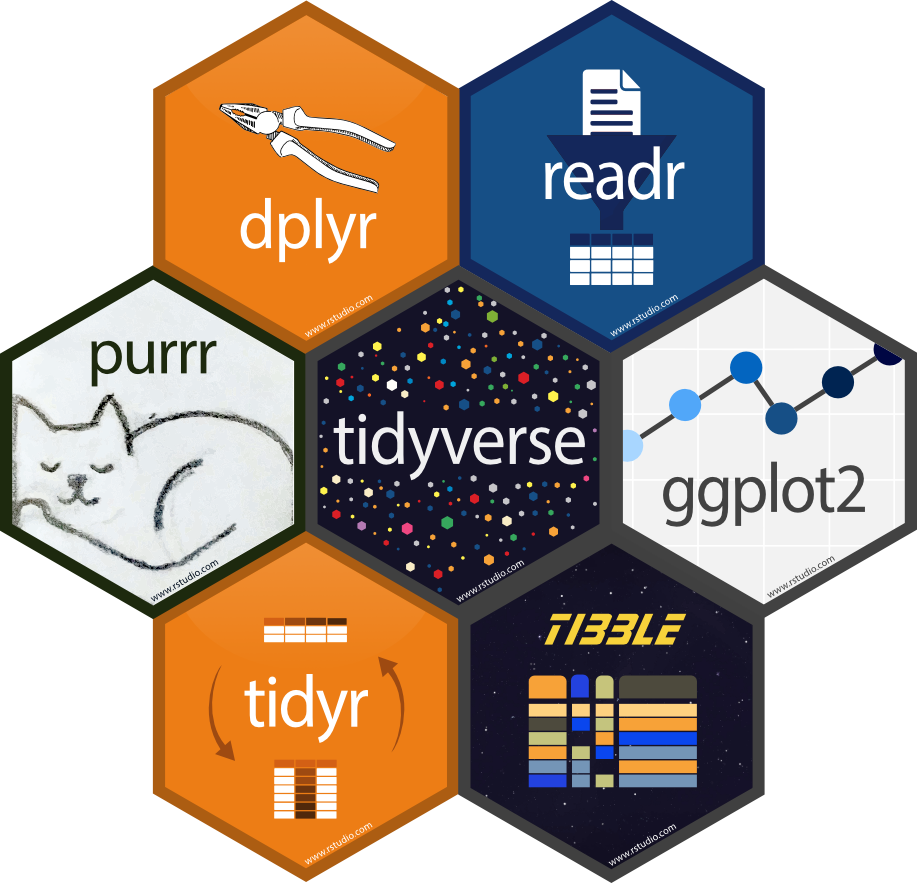

# Quien cuenta historias, domina el mundo

### Proverbio Hopi

# Campo Hopi {data-background=Imagenes/Hopi_Corn.png data-background-size=cover}

# Un efecto especial es una herramienta, un medio para contar una historia. Un efecto especial sin una historia es algo bastante aburrido

#### George Lucas

# {data-background=Imagenes/millennium-falcon.png data-background-size=cover}

# {data-background=Imagenes/ggplot_plots.png data-background-size=cover}

</center>

# Contenido
<div style="text-align: right;">
  - Sobre el Software
    - Que es R
    - Que es GIT
    - Directorios de Trabajo
    - Paquetes
    - Ayuda
    </div>
    
# Contenido
<div style="text-align: right;">  
  - Como utilizar R
    - Operadores
    - Objetos
    - Indexacion
    - Generacion de Datos
    - Graficos
    - Tidyverse
    
    
  - Practica
</div>

# Como trabajar


# Que es R?

R es un lenguaje de programación y un entorno de software diseñado específicamente para estadísticas y análisis de datos. Fue desarrollado por Ross Ihaka y Robert Gentleman en la Universidad de Auckland, Nueva Zelanda, en la década de 1990. Desde entonces, R se ha convertido en uno de los lenguajes más populares en el ámbito de la estadística y la ciencia de datos

## Características Clave

1. **Estadísticas y Análisis de Datos:** R es  potente para realizar análisis estadísticos y exploración de datos, se pueden realizar tareas como regresión, análisis de varianza, machine learning, y más.

2. **Gráficos:** R tiene excelentes capacidades para la visualización de datos. Puedes crear una variedad de gráficos de alta calidad para explorar y comunicar patrones en los datos.

3. **Comunidad y Paquetes:** R tiene una comunidad activa de usuarios y desarrolladores. Además, cuenta con un extenso sistema de paquetes que amplían sus capacidades.

4. **Investigación Académica y Empresarial:** R se utiliza en entornos académicos, de investigación y empresariales

5. **Integración con Otros Lenguajes y Herramientas:** R se puede integrar con otros lenguajes de programación como C, C++, y Python.

# Que es GIT?

**Git** es un sistema de control de versiones distribuido ampliamente utilizado. Fue creado por Linus Torvalds en 2005 y se ha convertido en una herramienta esencial para el desarrollo de software colaborativo.

## Beneficios de Git:

1. **Trabajo Colaborativo:** Git permite a varios desarrolladores trabajar en un proyecto simultáneamente sin temor a conflictos. Cada desarrollador puede trabajar en su propia rama y fusionar los cambios de manera eficiente.

2. **Historial y Auditoría:** El historial completo de cambios en un proyecto proporciona una trazabilidad clara y facilita la identificación de errores o problemas.

3. **Ramificación:** La capacidad de crear ramas fácilmente facilita el desarrollo de nuevas características y la corrección de errores sin afectar la rama principal del proyecto.

5. **Flexibilidad:** Git es flexible y se adapta a diversos flujos de trabajo, pequeños o grandes

6. **Respaldo y Recuperación:** La distribución y duplicación de repositorios proporciona una forma robusta de respaldar y recuperar proyectos en caso de fallos.

## Crear usuario en GIT

- Ir a https://github.com/signup?source=login
- Crear nuevo usuario 
- **! Crea un usuario facil de escribir y al mismo tiempo que se vea profesional**
- GIT tambien es un  buen portafolio profesional


## Instalacion de R & GIT

### Windows:

#### 1. R:
   - Descarga R desde el sitio oficial: https://cran.r-project.org/mirrors.html
   - Ejecuta el instalador descargado y sigue las instrucciones.

#### 2. Rtools (opcional pero recomendado para instalar paquetes adicionales):
   - Descarga Rtools desde https://cran.r-project.org/bin/windows/Rtools/
   - Ejecuta el instalador y sigue las instrucciones.

#### 3. Git:
   - Descarga Git desde https://git-scm.com/download/win
   - Ejecuta el instalador descargado y sigue las instrucciones.

## Instalacion de R & GIT
### macOS:

#### 1. R:
   - Puedes instalar R usando Homebrew con el siguiente comando en la terminal:
     ```bash
     brew install r
     ```

#### 2. Git:
   - Puedes instalar Git usando Homebrew con el siguiente comando en la terminal:
     ```bash
     brew install git    
     ```
     
## Patalla de R

{#id .class width=80% height=80%}

## Directorios de trabajo | y comentarios

En R, el directorio de trabajo es el lugar en el sistema de archivos donde R buscará y guardará archivos por defecto.

Comentarios: Proporciona información adicional sobre el propósito o funcionamiento del código #

```{r, echo=TRUE, message = FALSE}

###### Directorios de trabajo
#setwd("~/Users/lio/Git/Intro_R_2023")  #Mac
getwd() #Donde estamos trabajando?

# Comentarios
# comentario

```


# Paquetes

Los "paquetes" son un conjuntos de herramientas, funciones y datos que extienden la funcionalidad básica del lenguaje.

<center>

{#id .class width=40% height=40%}

</center>

## Paquetes

Los paquetes no se instalan automáticamente con R. Para utilizar un paquete, primero debes instalarlo.

Una vez instalado, debes cargar un paquete en tu sesión de R para poder utilizar sus funciones.

```{r, echo=TRUE, message = FALSE}

#install.packages("tidyverse")
#install.packages("dplyr")
library(tidyverse)
library(dplyr) 
#update.packages() #actualiza todos los paquetes que tengas instalados

```

# ¿Por qué debemos instalar los paquetes?

# Ayuda

En R, el signo de interrogación (?) se utiliza para acceder a la documentación de una función o de un paquete. Al colocar el signo de interrogación seguido del nombre de una función o paquete y ejecutar esa línea de código, R abrirá la documentación correspondiente en la ventana de ayuda.

```{r}
?print()
?lm #Busqueda Simple
??lm #Busqueda Amplia 
```


# Operadores 

Los operadores son símbolos o palabras clave que realizan operaciones en variables y valores.

- Operadores de asignación:
- Operadores aritméticos
- Operadores de comparación
- Operadores lógicos

## Operadores | Operadores de asignación

- Asignación de variables: <- o = 


```{r}
variable <- 42
variable
```

## Operadores | Operadores aritméticos

- Suma: + 
- Resta: - 
- Multiplicación: *
- División: /
- Potenciación: ^ o ** 
- Resto de la división entera: %% 
- Cociente de la división entera: %/% 

## Operadores | Operadores aritméticos

```{r}
a <- 10
b <- 3
suma <- a + b
resta <- a - b
multiplicacion <- a * b
division <- a / b

print(suma)
division
```

## Operadores | Operadores de comparación

- Igual a: == 
- No igual a: !=
- Menor que: < 
- Mayor que: > 
- Menor o igual que: <= 
- Mayor o igual que: >= 


```{r}
x <- 5
y <- 10
resultado <- x > y
print(resultado)
```

## Operadores | Operadores lógicos

- AND lógico: & 
- OR lógico: |
- NOT lógico: !

```{r}
condicion1 <- TRUE
condicion2 <- FALSE
resultado <- condicion1 & condicion2
print(resultado)
```


# Objetos 

En el contexto de R, "objetos" se refiere a las estructuras de datos que almacenan información.

- Funciones 
- Vectores
- Matrices
- Listas
- Data Frames (Marco de Datos)
- Factores


## Objetos 

```{r, echo=TRUE, message = FALSE}

## Recuerda que R es un lenguaje sensible a mayúsculas y minúsculas
(10 + 2) * 5
x <- (10 + 2) * 5  # <- es equivalente a =
x <- NA
x <- c(8,9,10,12,14,10,13,10,9)

print(x)

```

## Objetos | Funciones

Objetos que contienen código ejecutable.

| Informacion | Aritmética | Estadistica | Orden |
|--------------|--------------|--------------|--------------|
| summary(x)    |   min(x)  | sd(x)    | rev(x) 
| mode(x)    | max(x)    | var(x)    | unique(x) 
| length(x)     |   log(x)  | median(x)    | sort(x)
| range(x)     | sum(x)     | mean(x)     | rev(sort(x)) 

#¿Donde podemos encontrar más funciones?

## Objetos   

### Vectores: Clase genérica que permite almacenar una colección de objetos del mismo tipo

- Numericos: Almacenan números reales.
- Enteros: Almacenan números enteros.
- Lógicos: Almacenan valores booleanos (TRUE o FALSE).
- Caracteres: Almacenan texto

```{r}
# Ejemplos de vectores
numeric_vector <- c(1.5, 2.3, 4.0)
entero_vector <- c(1, 2, 3)
logico_vector <- c(TRUE, FALSE, TRUE)
caracteres_vector <- c("uno", "dos", "tres")

```

## Objetos | Vectores

```{r}
peso <- c(60, 72, 57, 90, 95, 72) 
altura <- c(1.75, 1.80, 1.65, 1.90, 1.74, 1.91)
imc <- peso/altura^2

print(imc)
```

## Objetos 

Matrices: Arreglos bidimensionales de elementos del mismo tipo.

```{r}
X <- matrix(c(1, 2, 3, 11, 12, 13), nrow=2, ncol=3, byrow=TRUE, 
            dimnames=list(c("fila1", "fila2"), c("C.1", "C.2", "C.3")))

X

X <- matrix(c(10, 10, 10, 10, 10, 10), nrow=2, ncol=3, byrow=TRUE, 
            dimnames=list(c("fila1", "fila2"), c("C.1", "C.2", "C.3")))

```

## Objetos | Matrices

<div class="columns-2">

```{r}
rownames(X) #nombre de filas
colnames(X) #nombre de columnas
nrow(X) #Numero de filas
ncol(X) #numero de columnas
dim(X) #dimensiones
t(X) #trasponer
```

</div>

# ¿Por qué se muestra la segunda matriz y no la primera?

## Objetos | Matrices

Manipulacion de Matrices

```{r}
C.4 <- c(100, 1000) #crear vector para 4ta columna 
X1 <- cbind(X, C.4) #Agregar 4ta columna a X
fila3 <- c(10, 100, 1000) #crear fila 3
X2 <- rbind(X, fila3) #agregar fila 3 a X

X2
```

## Objetos | Matrices

Manipulacion de Matrices

```{r}
#Donde se fue la Columna 4 (C.4)?
X2 <- rbind(X, fila3) #agregar fila 3 a X
fila3 <- c(10, 100, 1000, 10000) #crear fila 3
X3 <- rbind(X1, fila3) #agregar fila 3 a X

X3
```

## Objetos | Lista

Listas: Colecciones ordenadas de objetos de diferentes tipos.

<div class="columns-2">


```{r}
## Lista (grupos de cualquier tipo de objeto R)

lista_ejemplo <- list(numeric_vector, entero_vector, logico_vector, caracteres_vector)


lista_ejemplo
lista_ejemplo[[4]]

```

</div>

## Objetos | Data Frames

Estructuras de datos bidimensionales similares a las matrices, pero pueden contener columnas de diferentes tipos.

```{r}
# Ejemplo de data frame
data_frame_ejemplo <- data.frame(
  Nombre = c("Juan", "Maria", "Carlos"),
  Edad = c(25, 30, 22),
  Casado = c(FALSE, TRUE, FALSE)
)
data_frame_ejemplo
```

## Objetos | Data Frames

Manipulacion de Datos

<div class="columns-2">

```{r}

## Marco de datos (Data Frame)
data <- data.frame(alpha=1:3, 
                   beta=4:6, gamma=7:9)
names(data)[3] <- "tres"
data$tres <- NULL

# Reordenar marco de datos
data <- data.frame(id=1:3, peso=c(50, 90, 75), 
                   tamaño=c("pequeño", "grande", "mediano"))
data[c(1, 3, 2)]
data[c("tamaño", "id", "peso")]

```

</div>

## Objetos | Factores

Vectores que representan **variables categóricas** con **niveles** predefinidos.

```{r}
x <- factor(c("alpha", "beta", "gamma", "alpha", "beta"))
levels(x) #Distintos Valores unicos que puede tomar un factor
levels(x)[levels(x)=="beta"] <- "dos" #cambiamos beta por dos
levels(x)[3] <- "tres"  #cambiamos el tercer nivel por tres
levels(x) <- c("uno", "dos", "tres") #cambiamos todos los niveles por el vector
```

## Objetos | Manipulaciones

```{r}
# Convertir objetos
data <- as.matrix(data) #Para convertir en Matriz

data


```

¿Que tipos de datos hay en la matriz?

## Objetos | Manipulaciones

<div class="columns-2">

```{r}
# Convertir objetos
data

data_1 <- as.numeric(data) 
#Para convertir en Matriz

data_1 
#Que paso con nuestros datos? 

```

</div>

## Objetos | Manipulaciones

<div class="columns-2">

```{r}
# Convertir objetos

typeof(data)

data[,3] <- c(1,3,2)

data

# Convertir toda la matriz a tipo numérico
data_numeric <- as.numeric(data)

# Remodelar la matriz a sus dimensiones originales
dim(data_numeric) <- dim(data)

data_numeric
```

</div>

## Objetos | Manipulaciones


```{r}
x <- 1:20 #Creamos un Objeto
x[3] <- 100 #introducir 100 en el lugar 3

x

x[c(2, 4)] <- 111 #Introcir 111 en el lugar 2 y 4

x

#Que tipo de objeto es x?
```


# Indexacion

La indexación en R se refiere a la forma en que accedemos a elementos específicos en un objeto de datos, como vectores, matrices, listas o data frames.

https://rpubs.com/adiedrichs/basicIndexInR

```{r}
iris
```

## Indexacion

{#id .class width=70% height=70%}

## Indexacion

<div class="columns-2">

```{r}
head(iris[3]) #columna 3
head(iris[c(1, 2)])
head(iris[1,]) #Numero de fila
head(iris[,4])#Datos en Columna 4
head(iris[15,3])  #Numero de fila y columna
```

</div>

## Indexacion

Creamos dos vectores

<div class="columns-2">
```{r}
Sepalos_largo <- iris$Sepal.Length #en cm
Petalos_largo <- iris$Petal.Length #en cm

#Selleccionar vectores
Sepalos_largo > 6
Sepalos_largo[Sepalos_largo > 6]

```
</div>

## Indexacion
```{r}
Petalos_largo[Petalos_largo > 5]
Petalos_largo[Sepalos_largo > 6 & Petalos_largo > 6]
Petalos_largo[Sepalos_largo > 6 & Petalos_largo > 6]
```


## Generacion de Datos

<div class="columns-2">

```{r}
1:10
seq(from=1, to=10, by=1)
seq(1, 10, 1)
seq(length=9, from=1, to=5)
seq(1, 3, length=7)
c(1, 2, 3, 4, 5)
rep(1, 30)
rep(1:3, 10)

```
</div>

## Generacion de Datos

Relevamiento de rindes, (50 parcelas, media de 2,8 t/ha, sd=0,8) 

```{r}

rnorm(50,2.8,0.8) #n = observaciones, mean = media, sd = desviacion standart

#https://www.tutorialspoint.com/r/r_normal_distribution.htm
```

## Generacion de Datos
```{r,echo=FALSE}
hist(rnorm(50,2.8,0.8))
```

## Graficos
```{r}

plot(Sepalos_largo)
```

## Graficos
```{r}

plot(Sepalos_largo, type="p")

```

## Graficos
Relacion Lineal
```{r}
plot(Sepalos_largo~Petalos_largo, main="Iris", xlab="Sepalos (cm)", ylab="Petalos (cm)")

```

## Graficos
histograma
```{r}
hist(rnorm(50,2.8,0.8))

```


# tidyverse
`tidyverse` es un conjunto de paquetes de R diseñados para trabajar de manera integrada y coherente en el análisis de datos.

<center>

{#id .class width=40% height=40%}
</center>
## Paquetes | tidyverse 

Principales paquetes incluidos en `tidyverse`:

1. **ggplot2**: Para la creación de gráficos y visualizaciones.

2. **dplyr**: Para manipulación y transformación de datos.

3. **tidyr**: Para trabajar con datos en formato "tidy" (ordenados y estructurados).

4. **readr**: Para la importación limpia y eficiente de datos.

5. **purrr**: Para trabajar con funciones y listas de manera más eficiente.

6. **tibble**: Para crear y trabajar con data frames mejorados.

## Beneficios de usar `tidyverse`:

1. **Sintaxis coherente**: Los paquetes en `tidyverse` comparten una sintaxis coherente, lo que facilita aprender y recordar cómo realizar tareas comunes.

2. **Flujo de trabajo eficiente**: `tidyverse` está diseñado para proporcionar un flujo de trabajo eficiente y fácil de entender, desde la importación de datos hasta la visualización de resultados.

3. **Compatibilidad con piped operations**: La tubería `%>%` (pipe) facilita la aplicación de operaciones en secuencia, lo que mejora la legibilidad del código.

## `tidyverse`:

```{r}
# Instalar y cargar tidyverse
#install.packages("tidyverse")
library(tidyverse)

# Crear un data frame de ejemplo
data <- data.frame(
  ID = c(1, 2, 3, 4, 5),
  Nombre = c("Juan", "María", "Carlos", "Ana", "Pedro"),
  Edad = c(25, 30, 22, 28, 35)
)

```

## `tidyverse`:

```{r}

# Filtrar personas mayores de 25 años y seleccionar solo las columnas de ID y Nombre
resultado <- data %>%
  filter(Edad > 25) %>%
  select(ID, Nombre)

# Imprimir el resultado
print(resultado)

#https://rpubs.com/paraneda/tidyverse
```

# Practica

## Leer Datos
```{r}
## La separación decimal en R es . y no ,
#Datos en Millones de Guaranies
Ingreso <- read.csv("Datos/IngresoPromPoblacion_py.csv")
Ingreso <- read.table("Datos/IngresoPromPoblacion_py.csv", header=T,
                    na.strings = "4/", sep= ";", check.names = FALSE)

Ingreso
```

## Examinar Datos

```{r, eval = FALSE}
##Revisar Datos
head(Ingreso) #Primeros datos
tail(Ingreso) #Ultimos Datos
dim(Ingreso) #Tamaño 
names(Ingreso) #Nombre de Columnas
summary(Ingreso) #Sumario de Datos 
```

# ¿Que departamento tiene el mayor ingreso promedio?

# ¿Que departamento tiene el mayor ingreso promedio?
```{r}
#Cambiar a datos largos
dato_largo <- Ingreso %>%
  gather(key = "year", value = "Cantidad", -Departamento) %>%
  mutate(year = as.integer(year))

dato_largo
```

## ¿Que departamento tiene el mayor ingreso promedio?

```{r}
#Limpiar Datos
# Recortar espacios en blanco en columnas
dato_largo$Departamento <- str_trim(dato_largo$Departamento) 

# Reemplzar espacios en blanco en columnas
dato_largo$Departamento <- str_replace(dato_largo$Departamento, ' ', '_') 

# Reemplazar ciertos valores
any(is.na(dato_largo))  # Verificar valores faltantes (NAs)
#dato_largo[is.na(dato_largo)] <- 0  # Reemplazar NAs con 0s
```

## ¿Que departamento tiene el mayor ingreso promedio?

```{r}
# Agrupar los datos por departamento y encontrar el departamento con el mayor ingreso promedio
Mayor_Departamento <- dato_largo %>%
  group_by(Departamento) %>%
  summarize(Cantidad_total = mean(Cantidad, na.rm = TRUE)) %>%
  slice(which.max(Cantidad_total)) %>%
  ungroup()
```

## ¿Que departamento tiene el mayor ingreso promedio?

```{r, echo=FALSE}
# Agrupar los datos por departamento y encontrar el departamento con el mayor ingreso promedio
Mayor_Departamento <- dato_largo %>%
  group_by(Departamento) %>%
  summarize(Cantidad_total = mean(Cantidad, na.rm = TRUE)) %>%
  slice(which.max(Cantidad_total)) %>%
  ungroup()

Mayor_Departamento
```

## Otras Preguntas
```{r}
#Departamentos con ingresos mayor a 2.5 luego del 2000
resultados <- dato_largo %>%
  filter(Cantidad > 2.5 & year > 2000) %>%
  select(Departamento, year, Cantidad)

resultados
```

## Graficar
<center>
```{r, echo=FALSE}
# Crear una paleta de colores
colores <- rainbow(length(unique(resultados$Departamento)))

# Graficar puntos
plot(resultados$Cantidad ~ resultados$year, 
     col = colores[as.factor(resultados$Departamento)], 
     main = "Ingresos Promedio Paraguay", 
     xlab = "Año", 
     ylab = "Ingresos (Millones de Guaranies)")

# Agregar líneas conectando los puntos
for (depto in unique(resultados$Departamento)) {
  datos_depto <- resultados[resultados$Departamento == depto, ]
  lines(datos_depto$year, datos_depto$Cantidad, col = colores[depto])
}

# Leyenda
legend("topright", 
       legend = unique(resultados$Departamento), 
       fill = colores, 
       title = "Departamento")


```
</center>

## Otras Preguntas
```{r}
#Seleccionar Solo datos de Itapua
dato_largo_itapua <- dato_largo[dato_largo$Departamento == "Itapua", ]
Ingreso_Promedio_itapua <-  dato_largo_itapua$Cantidad

#Seleccionar Solo datos de Itapua
dato_largo_Boqueron <- dato_largo[dato_largo$Departamento == "Boqueron", ]
Ingreso_Promedio_Boqueron <-  dato_largo_Boqueron$Cantidad
```

